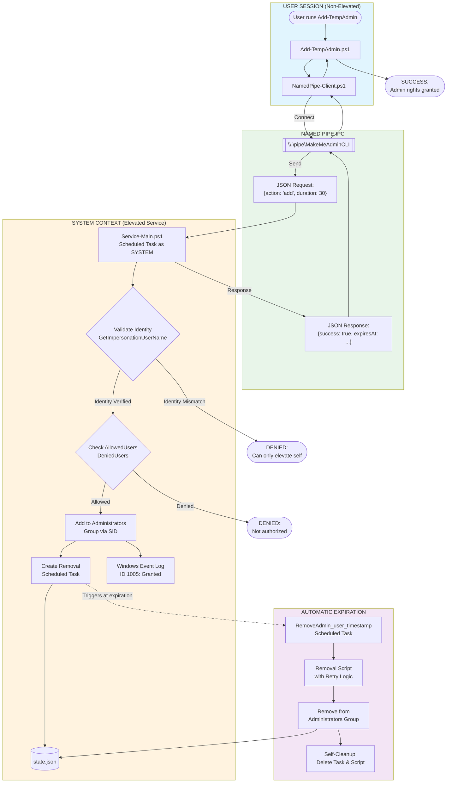
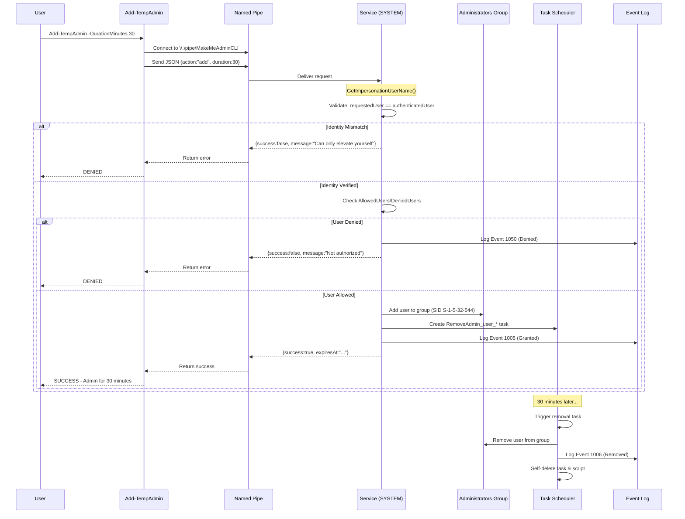

# MakeMeAdminCLI Flow Diagram Prompt

Use this prompt with diagram tools (Mermaid, Draw.io, Lucidchart) or AI image generators (DALL-E, Midjourney, Claude Artifacts).

---

## Prompt for Mermaid.js (GitHub/Markdown compatible)



---

## Prompt for AI Image Generator

```
Create a technical architecture diagram for a Windows privilege elevation system with these components:

LAYOUT: Left-to-right flow with 4 vertical swim lanes

SWIM LANE 1 - "User Session" (light blue background):
- Icon: User silhouette
- Box: "Add-TempAdmin" PowerShell cmdlet
- Box: "Named Pipe Client"
- Arrow pointing right labeled "JSON Request"

SWIM LANE 2 - "Named Pipe IPC" (light green background):
- Cylinder/pipe shape labeled "\\.\pipe\MakeMeAdminCLI"
- Bidirectional arrows
- Small boxes showing JSON format

SWIM LANE 3 - "SYSTEM Service" (light orange background):
- Box: "Service-Main.ps1" with subtitle "Runs as NT AUTHORITY\SYSTEM"
- Diamond: "Validate Identity" decision
- Diamond: "Check ACL" decision
- Box: "Add to Administrators Group (SID S-1-5-32-544)"
- Box: "Create Removal Task"
- Cylinder: "state.json"
- Box: "Event Log (ID 1005)"

SWIM LANE 4 - "Auto-Expiration" (light purple background):
- Clock icon with "30 min timer"
- Box: "Scheduled Task fires"
- Box: "Removal Script (3 retries)"
- Box: "Remove from Admins"
- Box: "Self-cleanup"

ARROWS:
- Solid arrows for main flow
- Dashed arrows for the expiration path
- Red arrows for denial paths

STYLE: Clean, professional, Microsoft Azure-style icons, white background, subtle shadows
```

---

## Prompt for Draw.io / Lucidchart (Step-by-step)

```
Create a system architecture diagram with these elements:

CONTAINERS (4 horizontal sections):

1. USER CONTEXT (Blue header)
   - Start: User icon "Standard User"
   - Process: "Add-TempAdmin Cmdlet"
   - Process: "NamedPipe-Client.ps1"
   - Data: "JSON Request { action, username, duration }"

2. IPC LAYER (Green header)
   - Pipe symbol: "\\.\pipe\MakeMeAdminCLI"
   - Note: "Windows handles authentication"
   - Bidirectional arrow

3. SYSTEM CONTEXT (Orange header)
   - Process: "Service-Main.ps1"
   - Subprocess: "Scheduled Task (SYSTEM)"
   - Decision: "Identity Match?" (Yes/No paths)
   - Decision: "User Allowed?" (Yes/No paths)
   - Process: "AdminGroup-Functions.ps1"
   - Database: "Administrators Group (SID)"
   - Process: "ScheduledTask-Functions.ps1"
   - Database: "state.json"
   - Process: "Logging-Functions.ps1"
   - Database: "Event Log"

4. EXPIRATION SYSTEM (Purple header)
   - Timer: "Expiration Time"
   - Process: "RemoveAdmin_* Task"
   - Process: "Removal Script"
   - Loop: "Retry (3 attempts)"
   - Process: "Remove from Group"
   - Terminator: "Self-delete task & script"

FLOW ARROWS:
   User -> Cmdlet -> Client -> Pipe -> Service
   Service -> Identity Check -> ACL Check -> Add to Group
   Add to Group -> Create Removal Task -> Update State -> Log Event
   Service -> Response -> Pipe -> Client -> User

   [Dashed] Removal Task -> Removal Script -> Remove from Group -> Cleanup

DENIAL PATHS (Red):
   Identity Check (No) -> "Denied: Can only elevate yourself"
   ACL Check (No) -> "Denied: Not authorized"
```

---

## Prompt for Sequence Diagram (Mermaid)



---

## Simple ASCII Diagram

```
┌─────────────────────────────────────────────────────────────────────────────┐
│                              MakeMeAdminCLI Flow                            │
└─────────────────────────────────────────────────────────────────────────────┘

  USER SESSION                    IPC                      SYSTEM SERVICE
  ────────────                    ───                      ──────────────
       │                                                         │
       │  Add-TempAdmin                                          │
       │       │                                                 │
       ▼       ▼                                                 │
  ┌─────────────────┐         ┌─────────────┐         ┌─────────────────────┐
  │ NamedPipe-Client│────────►│ Named Pipe  │────────►│   Service-Main.ps1  │
  │    (JSON)       │◄────────│\\.\pipe\... │◄────────│   (runs as SYSTEM)  │
  └─────────────────┘         └─────────────┘         └──────────┬──────────┘
                                                                 │
                              ┌───────────────────────────────────┤
                              │                                   │
                              ▼                                   ▼
                     ┌────────────────┐                 ┌─────────────────┐
                     │ Validate User  │                 │ Check ACL       │
                     │ Identity       │                 │ (Allow/Deny)    │
                     └───────┬────────┘                 └────────┬────────┘
                             │                                   │
                             │ PASS                              │ PASS
                             ▼                                   ▼
                     ┌────────────────────────────────────────────────────┐
                     │              Add to Administrators Group            │
                     │                  (SID S-1-5-32-544)                 │
                     └────────────────────────┬───────────────────────────┘
                                              │
                    ┌─────────────────────────┼─────────────────────────┐
                    │                         │                         │
                    ▼                         ▼                         ▼
           ┌───────────────┐        ┌─────────────────┐       ┌─────────────┐
           │ Create Removal│        │ Update state.json│       │  Event Log  │
           │ Scheduled Task│        │                  │       │  ID: 1005   │
           └───────┬───────┘        └──────────────────┘       └─────────────┘
                   │
                   │ (fires at expiration time)
                   ▼
           ┌───────────────────────────────────────┐
           │         REMOVAL TASK (SYSTEM)         │
           │  ┌─────────────────────────────────┐  │
           │  │ 1. Remove from Admins group     │  │
           │  │ 2. Update state.json            │  │
           │  │ 3. Log Event 1006               │  │
           │  │ 4. Delete self (task + script)  │  │
           │  └─────────────────────────────────┘  │
           │         (Retry 3x if fails)           │
           └───────────────────────────────────────┘
```

---

## Color Scheme Reference

| Component | Hex Color | RGB | Usage |
|-----------|-----------|-----|-------|
| User Context | #E1F5FE | 225,245,254 | Light blue |
| IPC Layer | #E8F5E9 | 232,245,233 | Light green |
| System Service | #FFF3E0 | 255,243,224 | Light orange |
| Expiration | #F3E5F5 | 243,229,245 | Light purple |
| Denied/Error | #FFEBEE | 255,235,238 | Light red |
| Success | #E8F5E9 | 232,245,233 | Light green |
